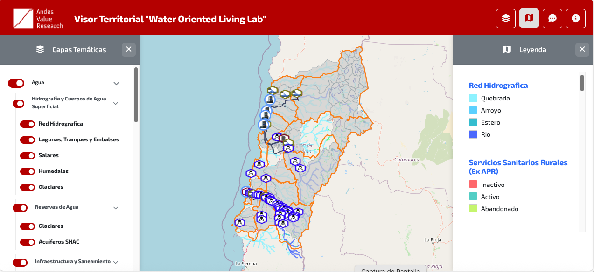

# Visor Territorial Atacama Andes Value

> Plataforma SIG (Sistema de Información Geográfica) para la gestión y visualización de datos estratégicos en la Región de Atacama, potenciada con Inteligencia Artificial.


---

## 🎯 ¿Qué es este proyecto?

El Visor Territorial es una aplicación web interactiva que permite visualizar y analizar datos geoespaciales de la Región de Atacama. Integra mapas dinámicos con un asistente de IA para democratizar el acceso al análisis territorial.

### Características principales

- 🗺️ **Visualización geoespacial** interactiva basada en Leaflet.js
- 🤖 **Asistente IA** context-aware para consultas territoriales
- 📊 **Múltiples capas de datos** (minería, agua, agricultura, energía)
- 🔍 **Búsqueda semántica** de elementos geográficos
- 📱 **Diseño responsive** para móviles y desktop
- ⚡ **Optimizado** con Web Workers para alto rendimiento

---

## 🖼️ Demo



**Demo en vivo:** [https://visorwoll-atacama.vercel.app]

---

## 📋 Requisitos Previos

- Node.js >= 16.x (solo para desarrollo local con servidor estático)
- Navegador moderno (Chrome, Firefox, Safari, Edge)
- Cuenta en Vercel (para despliegue)
- API Key de Groq (para funcionalidad de IA)

---

## 🚀 Inicio Rápido

### 1. Clona el repositorio

```bash
git clone https://github.com/atacama-andes-value/visor-territorial.git
cd visor-territorial
```

### 2. Configura las variables de entorno

Crea un archivo `.env` en la raíz del proyecto:

```bash
GROQ_API_KEY=tu_api_key_aqui
```

### 3. Ejecuta localmente

**Opción A - Con servidor estático simple:**
```bash
npx http-server -p 8080
```

**Opción B - Con Python:**
```bash
python -m http.server 8080
```

**Opción C - Con PHP:**
```bash
php -S localhost:8080
```

### 4. Abre en tu navegador

```
http://localhost:8080
```

---

## 🛠️ Tecnologías

### Frontend
- **Mapa:** Leaflet.js 1.9+
- **UI:** Vanilla JavaScript (ES6+)
- **Estilos:** CSS3 con variables personalizadas
- **Procesamiento:** Web Workers

### Backend/API
- **Serverless:** Vercel Functions
- **IA:** Groq API (LLM)
- **Runtime:** Node.js

### Datos
- **Formato:** GeoJSON
- **Servicios:** WMS (Web Map Service)

---

## 📁 Estructura del Proyecto

```
visor-territorial/
├── index.html              # Punto de entrada
├── api/
│   └── chat.js            # Endpoint serverless para IA
├── css/
│   ├── base.css           # Estilos base y variables
│   ├── components.css     # Componentes UI
│   └── mobile.css         # Adaptaciones móviles
├── js/
│   ├── config/            # Configuraciones de capas por dimensión
│   ├── utils/             # Utilidades y motores lógicos
│   └── store/             # Gestión de estado
├── geojson/               # Archivos de datos geográficos
├── assets/                # Iconos e imágenes
└── docs/                  # Documentación extendida
```

---

## 📖 Documentación

- **[Guía de Desarrollo](docs/DEVELOPMENT.md)** - Cómo contribuir y desarrollar
- **[Arquitectura del Sistema](docs/ARCHITECTURE.md)** - Diseño técnico detallado
- **[Configuración de Capas](docs/CONFIGURATION.md)** - Cómo agregar/modificar capas
- **[API Reference](docs/API.md)** - Documentación de endpoints

---

## 🔧 Configuración Básica

### Agregar una nueva capa GeoJSON

1. Coloca tu archivo `.geojson` en `/geojson/`
2. Edita el archivo de configuración correspondiente en `/js/config/`
3. Reinicia el servidor

**Ejemplo mínimo:**

```javascript
nueva_capa: {
  url: "mi_capa.geojson",
  type: "point",
  nombrePersonalizado: "Mi Nueva Capa",
  popupCampos: ["nombre", "descripcion"]
}
```

Ver [CONFIGURATION.md](docs/CONFIGURATION.md) para opciones avanzadas.

---

## 🚢 Despliegue en Vercel

### Despliegue automático

1. **Conecta tu repositorio:**
   - Ve a [vercel.com](https://vercel.com)
   - Importa el repositorio desde GitHub

2. **Configura variables de entorno:**
   ```
   GROQ_API_KEY = tu_clave_aqui
   ```

3. **Despliega:**
   - Vercel detectará automáticamente la configuración
   - El despliegue se ejecutará en cada push a `main`

### Despliegue manual

```bash
npm install -g vercel
vercel --prod
```

---

## 🤝 Contribuir

Este es un proyecto privado de Atacama Andes Value. Si eres parte del equipo:

1. Crea una rama desde `develop`
2. Realiza tus cambios
3. Abre un Pull Request hacia `develop`

### Convenciones de commits

```
feat: Nueva funcionalidad
fix: Corrección de bug
docs: Cambios en documentación
style: Cambios de formato (no afectan funcionalidad)
refactor: Refactorización de código
perf: Mejoras de rendimiento
test: Agregar o modificar tests
```

---

## 🧪 Testing

```bash
# Ejecutar tests (cuando estén implementados)
npm test

# Validar estructura de GeoJSON
npm run validate-geojson
```

---

## 📊 Dimensiones Disponibles

| Dimensión | Capas | Estado |
|-----------|-------|--------|
| 💧 Agua | 12 capas | ✅ Activo |
| ⛏️ Minería | 8 capas | ✅ Activo |
| 🌾 Agricultura | 15 capas | ✅ Activo |
| ⚡ Energía | 6 capas | ✅ Activo |
| 🏛️ Patrimonio | 9 capas | ✅ Activo |

---

## ⚠️ Troubleshooting

### El mapa no carga

1. Verifica la consola del navegador (F12)
2. Asegúrate de tener conexión a Internet
3. Revisa que los archivos GeoJSON estén en `/geojson/`

### La IA no responde

1. Verifica que `GROQ_API_KEY` esté configurada
2. Revisa los logs en Vercel Dashboard
3. Comprueba límites de cuota de la API

### Errores de CORS

Asegúrate de estar ejecutando un servidor HTTP, no abriendo el archivo directamente (`file://`).

---

## 📄 Licencia

**Propiedad de Atacama Andes Value**  
Todos los derechos reservados © 2026

---

## 👥 Equipo

**Desarrollador Principal:** [Diego Velàsquez]  
**Cliente:** Atacama Andes Value  
**Contacto:** [diegovelasquezf@gmail.com]

---

## 📝 Changelog

### v3.0 (Enero 2026)
- Refactorización completa de la arquitectura
- Integración de IA con Groq
- Sistema de búsqueda semántica
- Mejoras de rendimiento con Web Workers

### v2.x
- [Ver changelog completo](CHANGELOG.md)

---

**Versión:** 3.0  
**Última Revisión:** Enero 2026


